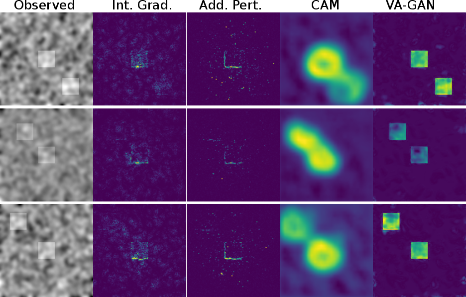
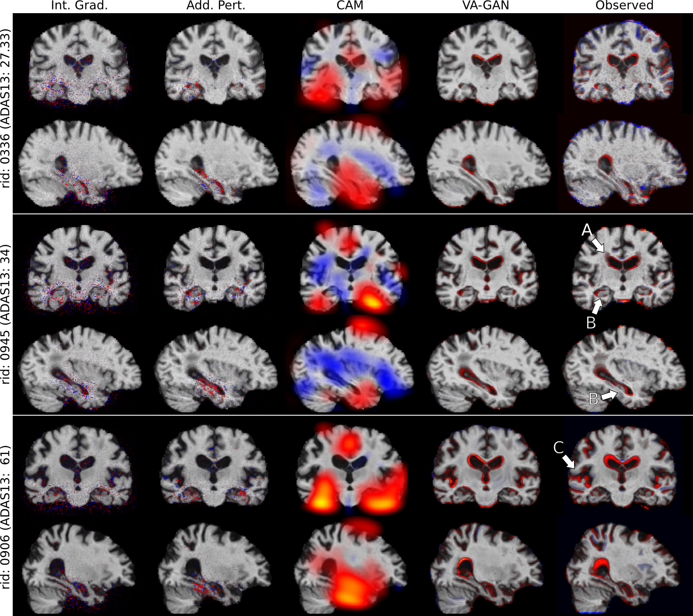
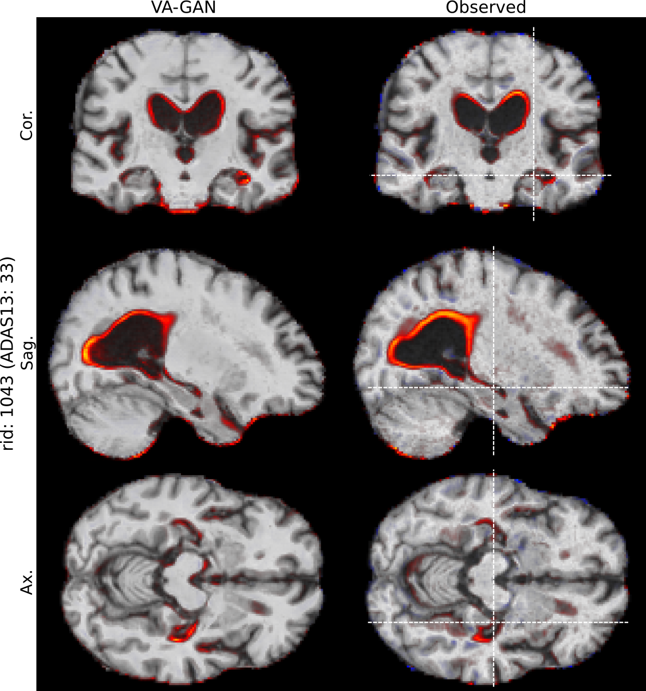

# VAGAN Code


Public tensorflow implementation for the **Visual Feature Attribution using Wasserstein GANs** method, 
which was accepted for presentation at [CVPR 2018](http://cvpr2018.thecvf.com/). 

If you find this code helpful in your research please cite the following paper:

```
@article{baumgartner2017visual,
  title={Visual Feature Attribution using Wasserstein GANs},
  author={Baumgartner, Christian F and Koch, Lisa M and Tezcan, Kerem Can and Ang, Jia Xi and Konukoglu, Ender},
  journal={arXiv preprint arXiv:1711.08998},
  year={2017}
}
```

The paper can be
found [here](https://arxiv.org/pdf/1711.08998.pdf). 

*Abstract*: Attributing the pixels of an input image to a certain category
is an important and well-studied problem in computer
vision, with applications ranging from weakly supervised
localisation to understanding hidden effects in the data.
In recent years, approaches based on interpreting a previously
trained neural network classifier have become the
de facto state-of-the-art and are commonly used on medical
as well as natural image datasets. In this paper, we
discuss a limitation of these approaches which may lead
to only a subset of the category specific features being detected.
To address this problem we develop a novel feature
attribution technique based on Wasserstein Generative
Adversarial Networks (WGAN), which does not suffer from
this limitation. We show that our proposed method performs
substantially better than the state-of-the-art for visual attribution
on a synthetic dataset and on real 3D neuroimaging
data from patients with mild cognitive impairment (MCI)
and Alzheimer’s disease (AD). For AD patients the method
produces compellingly realistic disease effect maps which
are very close to the observed effects.

Author of this code:
- Christian F. Baumgartner ([email](mailto:baumgartner@vision.ee.ethz.ch))

## How to get the code to run:

 * Step 1: Set up a virtual environment (e.g. conda or virtualenv) with Python 3 (I used 3.4.3), and tensorflow 
 (I used version 1.2). There is a requirements.txt file so `pip install -r requirements.txt`
  should work.

Potential caveat: We had to use the dev version of skimage to allow for 3D image 
resampling of the ADNI data. Previously, we had problems to compile it with anything 
else but Python 3.4.3. However, if you don't need this function 
(which you don't on 2D data) you can simply use the normal `pip install scikit-image`.


 * Step 2: Open `config/system.py` and change the settings to match your system.

 * Step 3: Run the method by executing `python vagan_train`, which should automatically build the synthetic data, run the WGAN training, 
 and write the progress to tensorboard (`tensorboard --logdir=logdir/gan --port=8008`).
 It takes around 1h hour or 1000 steps to train the method on synthetic data. 

 * Step 4: Get some results on the test set by running: `python vagan_test_loop.py logdir/gan/synthetic_experiment` (runs without GPU)

You can also train a classifier (`classifier_train.py`) and then generate all the 
types of saliency maps discussed in the paper using the `classifier_test_saliencies.py` 
script.

## How is the code structured:

 * All scripts that can be run directly using `python <script>.py` are in the base 
 directory. 
 * All other code pertaining to VA-GAN is in the `vagan` folder. All code pertaining to the 
   classifier and the conventional saliency maps is in the folder `classifier`
 * The main code for VA-GAN can be found in `vagan/model_vagan.py`
 * All code pertaining to the different data sets is in the `data` folder
 * `tfwrapper` contains shortcuts for building layers etc. 

## Tricks for training and tuning

 * Using the `tanh` function after the generator output can make training more stable. This requires
   that the input data is scalled into the range of -1, to 1. 
 * The Wasserstein distance, i.e. negative critic loss, can be used for determining 
   how well the network is doing. Values closer to 0 usually produce better results. However, 
   the Wasserstein distance tends to be so noisy that choosing the final model on the best
   value does not work well. 
 * The best way to select a model is to look at the generated validation images in 
   tensorboard. 
 * VA-GAN does overfit when trained too long or with insufficient data. For instance the synthetic experiment with only 
   1000 data points does not produce good results. If your data set is not big enough you
   may wish to play around with dropout and weight decay for the critic and map generator.
 * The default network for the synthetic experiments (`normalnet2D`) is modelled after the 3D experiment, so
   it has an unusual layer structure. Other architectures (e.g. >1 layers per max pooling step)
   may produce better results. 
   
   
## Bugs
 
Please use the issue tracking tool to report bugs or email directly to [baumgartner@vision.ee.ethz.ch](mailto:baumgartner@vision.ee.ethz.ch). 

## Results

### Synthetic data



### ADNI brain data



### Close up of observed disease effects vs VA-GAN prediction in 3 planes. 



